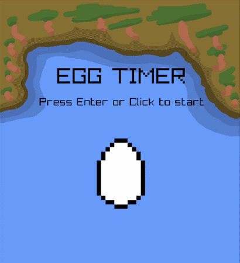

# Egg Timer

A small desktop egg timer application developed with **C++** and **raylib**.

Egg Timer allows you to choose between **Hard-Boiled** and **Soft-Boiled** eggs and provides recommended cooking times for both options.

The project was originally created as a small programming exercise and was later polished with mouse navigation, custom buttons, audio and additional visual elements.

---

## Preview

---

## Features

- Hard-Boiled and Soft-Boiled egg selection
- Recommended cooking times
- Animated Startscreen
- Animated selection arrow
- Stopwatch
- Start / Pause functionality
- Reset functionality
- Mouse navigation
- Keyboard controls
- Clickable egg selection
- Custom pixel-art buttons
- Home button
- Button sound effects
- Looping background music
- Windows release build with custom application icon

---

## New / Updated Features

The original version of Egg Timer was expanded and polished with:

- Added full mouse navigation
- Added clickable egg selection
- Added Start / Stop button
- Added Reset button
- Added Home button
- Added recommended cooking times
- Added button sound effects
- Added looping background music
- Added custom application icon
- Improved timer screen layout
- Improved overall navigation and usability
- Keyboard shortcuts remain available as an alternative to mouse controls

---

## Controls

### Mouse

| Action | Function |
| --- | --- |
| Click Startscreen | Continue to egg selection |
| Click Hard-Boiled / Soft-Boiled | Select egg and open timer |
| Start / Stop Button | Start or pause timer |
| Reset Button | Reset timer |
| Home Button | Return to Startscreen |

### Keyboard

| Key | Action |
| --- | --- |
| Enter | Start / Confirm selection |
| ← / → | Select egg |
| Space | Start / Pause timer |
| R | Reset timer |
| H | Return to Startscreen |

---

## Music Credits

**"Theme Song"**  
Written and produced by **Ove Melaa**  
Omsofware@hotmail.com

---

## Built With

- **C++**
- **raylib**
- **Aseprite**

---

Created by **Timo Mehring**